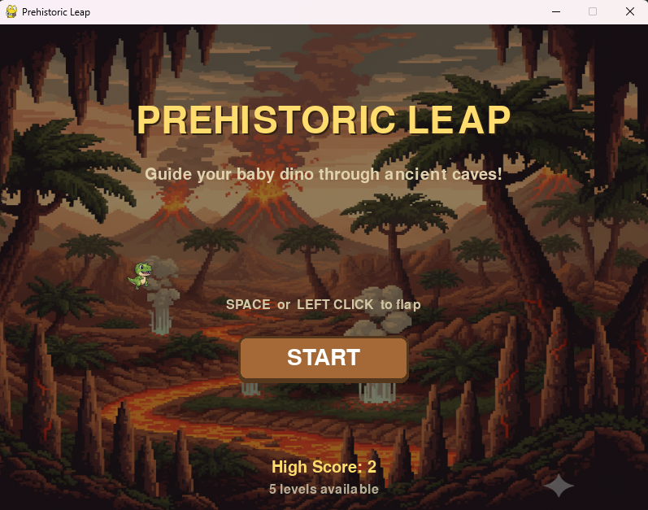

# Prehistoric Leap

A Flappy-Bird-style arcade game set in prehistoric times, built with Python and Pygame as part of the **Codecademy AI Maker Bootcamp**.



## The Story of Tiny


Meet **Tiny** — a baby T-Rex with big dreams and even bigger teeth. When a volcanic eruption tears through his homeland, Tiny has no choice but to flee through the ancient caves beneath the earth. But the caves aren't empty. Jagged stone pillars block every turn, hungry velociraptors patrol the skies, and the only comfort along the way are the scattered gold coins left behind by civilizations long forgotten. Armed with nothing but his tiny arms and a whole lot of courage, Tiny leaps into the unknown. How far can you take him?

<br clear="left" />

## Features

- 🦖 Fly Tiny through procedurally generated stalactites & stalagmites
- 🦅 Dodge velociraptors flying in on unpredictable wave patterns
- 🪙 Collect gold coins that spawn between walls for bonus points
- 📈 5 levels that scale automatically — from *Stone Age* to *Meteor Strike*
- 🏆 Persistent high score saved to disk
- 🎵 Full sound design — background music, flap, enemy alert, coin pickup, game over
- ⚙️ Data-driven difficulty via `levels.json` — tweak everything without touching code

## How to Play

| Input | Action |
|---|---|
| `SPACE` | Flap |
| `Left Click` | Flap |

Fly through wall gaps (+1 score each), collect coins, avoid everything else. The game gets harder as your score climbs. That's it — simple to learn, tough to master.

## Levels

| # | Name | Starts at | Speed | Coin Value |
|---|---|---|---|---|
| 1 | Stone Age | Score 0 | Slow | 1x |
| 2 | Jurassic Era | Score 5 | Medium | 1x |
| 3 | Cretaceous Period | Score 12 | Fast | 1x |
| 4 | Extinction Event | Score 22 | Faster | 2x |
| 5 | Meteor Strike | Score 35 | Max | 2x |

## Running Locally


### 1. Clone the repo

```bash
git clone <repository-url>
cd prehistoric-leap
```

### 2. Activate the virtual environment

Windows:

```bash
gaming\Scripts\activate
```

macOS/Linux:

```bash
source gaming/bin/activate
```

### Install dependencies & run
```bash
pip install -r requirements.txt
python main.py
```

## Configuration

Everything lives in `levels.json` — gravity, wall speed, gap size, enemy frequency, coin spawn chance, coin value, and more. Add levels, remove them, or rebalance the whole game from one file.

To reset your high score, edit `highscore.json` or just delete it.

## Tech Stack

| Tech | Role |
|---|---|
| Python 3.10+ | Core language |
| Pygame 2.5+ | Rendering, audio, input, collisions |
| JSON | Level config & high-score persistence |

## Project Context

Built as part of the **Codecademy AI Maker Bootcamp**, focusing on game design, procedural content generation, and data-driven architecture.
